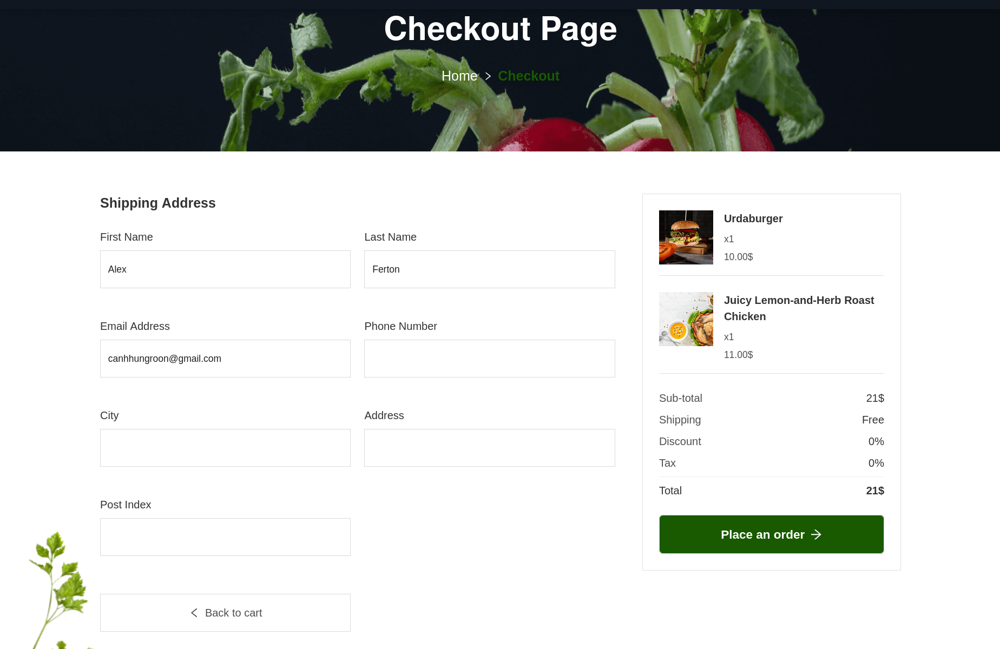

# Foodtuck

Project developed using Spring Boot and React.js.

## Used Technologies

* Back-end: Spring (Boot, Data, Security), JPA / Hibernate, PostgreSQL
* Front-end: TypeScript, React.js, Redux Toolkit, Ant Design
* Security: JWT
* REST API
* Server Build: Maven
* Client Build: npm, yarn, webpack

## Features

* Authentication with JWT and Email validation.
* Customers can search for the product according to the specified criteria.
* Customers can add and delete products from the shopping cart.
* Customers can order the products in the shopping cart.
* Customers can update their profiles and view their orders.

## Installation

1. Install maven: [link](https://www.baeldung.com/install-maven-on-windows-linux-mac)
2. Install Java 17: [link](https://www.oracle.com/java/technologies/javase/jdk17-archive-downloads.html)
3. Install Intellij IDEA Ultimate: [link](https://www.jetbrains.com/idea/)
4. Install Postgresql: [link](https://www.postgresql.org/download/)
5. Open pgAdmin and create a new DB (name: foodtuck) in Postgresql: [link](https://www.guru99.com/postgresql-create-database.html#:~:text=PostgreSQL%20Create%20Database%20using%20pgAdmin)
6. Add Postgresql properties to the application.properties file: [link](./frontend/metadata/assets/setup-gmail.png)
7. Add Lombok and GraphQL plugins to the Intellij IDEA (File/Settings/Plugins)
8. Add gmail account and app password to the application.properties file [link](https://myaccount.google.com/apppasswords)
9. Install node.js and npm: [link](https://docs.npmjs.com/downloading-and-installing-node-js-and-npm)
10. Now you can run application (port 8080) and open terminal in client directory and type: npm run dev
11. Navigate to <http://localhost:5173>

## Screenshots

Shop page  |  Product page
:------------------------:|:-------------------------:
  |  

Cart  |  Checkout
:------------------------:|:-------------------------:
  |  

Email template  |  List of orders
:------------------------:|:-------------------------:
 | 

Order page | User profile page
 :------------------------: | :------------------------:
 | 
